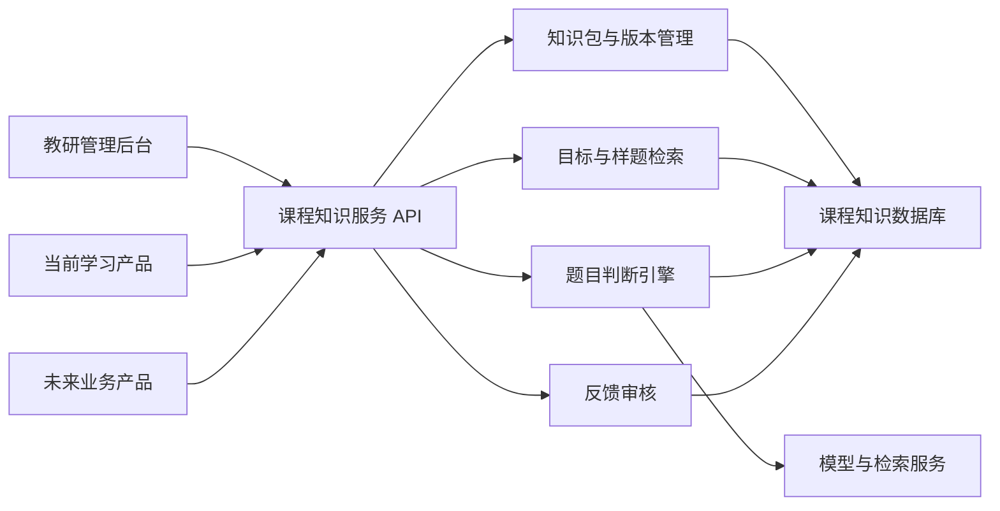
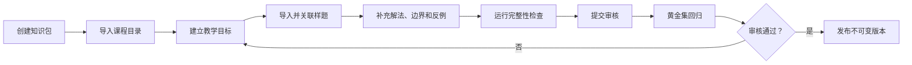
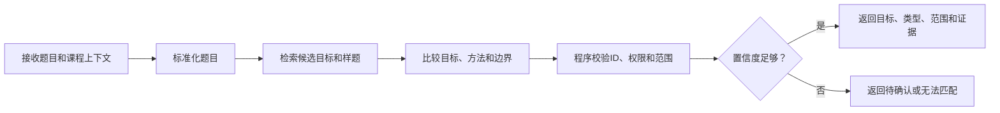
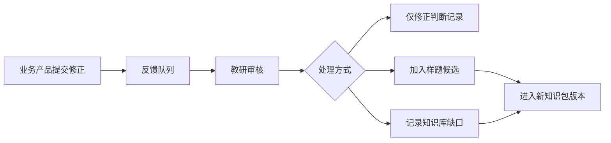
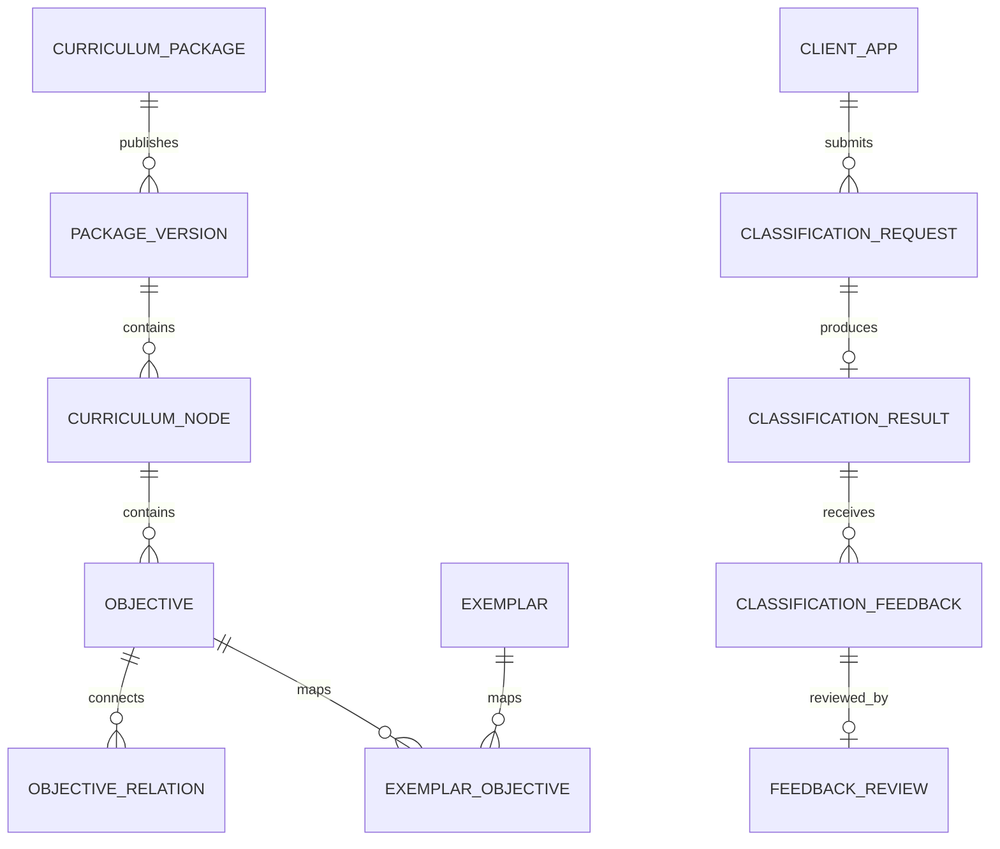

> 暂定产品名：Kiko 课程知识服务（Kiko Curriculum Knowledge Hub）

## 0. 文档信息

| 项目 | 内容 |
|---|---|
| 文档版本 | V1.0 |
| 文档状态 | 评审稿 |
| 创建日期 | 2026-07-29 |
| 产品负责人 | 待定 |
| 教研负责人 | 待定 |
| 技术负责人 | 待定 |
| 首期接入方 | Kiko 当前学习产品 |

### 0.1 修订记录

| 版本 | 日期 | 修改人 | 修改内容 |
|---|---|---|---|
| V1.0 | 2026-07-29 | Codex | 首版完整 PRD |

---

## 1. 产品摘要

课程知识底座是一套独立于具体学习产品的教材知识管理与题目归属判断服务。

它以课程标准、教材目录、可评测教学目标、教材例题、配套习题、标准解法、边界题和反例为依据，对调用方提交的题目进行可追溯判断，并返回：

- 主要教学目标；
- 次要教学目标；
- 教材位置；
- 原型题、变式题、综合题、拓展题等匹配类型；
- 当前范围、前置范围、后续范围等范围状态；
- 教材样题和判断摘要；
- 判断置信度；
- 所使用的知识包和模型版本。

课程知识底座由两部分组成：

1. 面向教研和内容运营的知识管理后台；
2. 面向当前产品及未来产品的版本化 API 服务。

本产品不承载学生学习流程、题目作答、推荐策略或学生掌握度计算。

---

## 2. 背景与问题

### 2.1 当前问题

现有知识点识别通常依赖题目文字、图片或答案表面特征，直接从已有标签中选择一个知识点。该模式存在以下问题：

1. 知识点定义缺少统一教材依据；
2. 相同名称在不同教材版本中的范围可能不同；
3. 分类结果无法说明依据了哪一页教材、哪一道例题；
4. 原型题、同类变式、综合题、拓展题和超出当前范围的题目容易混淆；
5. 未匹配到知识点时，容易被错误判断为“超纲”；
6. 知识点拆分、合并或改名时，历史题目和学生记录难以兼容；
7. 当前产品与知识点系统耦合，未来其他产品无法复用；
8. 教研修正结果无法稳定沉淀为可复用的判断边界。

### 2.2 核心判断

问题的根源不是缺少更多知识点名称，而是缺少一套：

- 有教材来源；
- 有标准样题；
- 有标准解法；
- 有边界和反例；
- 有版本；
- 可验证；
- 可复用；
- 可追溯

的课程知识服务。

### 2.3 建设机会

将知识点底座独立产品化，可以让多个业务产品共享同一套教材知识和判断能力，同时让教研内容的修改、审核与发布不再依赖业务产品发版。

---

## 3. 产品愿景与定位

### 3.1 产品愿景

成为 Kiko 所有教育产品统一、可信、可追溯的课程知识来源和题目归属判断基础设施。

### 3.2 产品定位

课程知识底座是“教材知识管理系统 + 题目判断服务”，不是题库、推荐系统或学生模型。

### 3.3 核心价值

对业务产品：

- 使用统一的知识目标ID和判断标准；
- 减少每个产品重复建设知识点系统；
- 获得有教材证据的题目判断结果；
- 可按教材版本、年级和学习进度判断范围；
- 知识库升级时无需业务产品同步发版。

对教研：

- 将教材目标、样题、边界和反例集中管理；
- 通过审核和版本发布控制线上质量；
- 将人工修正沉淀为新的判断证据；
- 查看最易混淆的教学目标和知识缺口。

对最终用户：

- 获得更准确、更容易理解的题目归属；
- 知道判断对应的教材位置和依据；
- 减少错误知识点带来的错误练习推荐。

---

## 4. 产品目标与非目标

### 4.1 首期目标

1. 建立可复用、版本化的教材知识包数据结构；
2. 支持教研创建、审核、发布和回滚知识包；
3. 支持用教材样题、标准解法和边界规则判断上传题目；
4. 每次判断都返回有效的教学目标ID、教材证据和版本信息；
5. 区分匹配类型与学习范围状态；
6. 支持当前产品通过 API 接入并保持旧知识点兼容；
7. 支持人工确认和修正，并形成教研审核闭环；
8. 证明新增第二套教材知识包不需要修改核心代码和数据表结构。

### 4.2 首期非目标

以下能力不在首期范围：

- 学生掌握度计算；
- 个性化推荐策略；
- 完整题库管理；
- 自动组卷；
- 自动生成大量变式题；
- 复杂心理测量模型；
- 面向第三方公开售卖的开放平台；
- 无人审核的教材知识自动发布；
- 一次性覆盖全部学科、年级和教材版本；
- 建设专用图数据库；
- 替代调用产品已有的用户、订单、作业和答题系统。

### 4.3 成功定义

首期成功不以录入多少知识点衡量，而以以下结果衡量：

- 一套完整教材可以被稳定发布为知识包；
- 上传题目能够引用教材目标和样题完成判断；
- 判断结果可被教研复核和解释；
- 当前产品能够稳定调用；
- 第二套教材仅通过内容导入完成接入。

---

## 5. 用户与角色

### 5.1 主要用户

| 角色 | 使用目的 |
|---|---|
| 教研编辑 | 建设教材目录、教学目标、样题和判断边界 |
| 教研审核员 | 审核内容变化、修正和发布版本 |
| 内容运营 | 导入教材资料、维护来源和处理任务队列 |
| 系统管理员 | 管理用户、权限、调用方和系统配置 |
| 业务产品 | 通过 API 提交题目并使用判断结果 |
| 研发与算法人员 | 维护检索、判断、版本和监控能力 |

### 5.2 权限角色

| 权限角色 | 主要权限 |
|---|---|
| Viewer | 查看已发布知识包、目标、样题和判断记录 |
| Editor | 编辑草稿知识包、教学目标、样题和关系 |
| Reviewer | 审核内容、处理反馈、批准或驳回发布 |
| Publisher | 发布、弃用和回滚知识包版本 |
| Admin | 用户、权限、调用方、密钥和系统配置管理 |
| Client App | 通过 API 查询知识包、提交判断和反馈 |

同一用户可拥有多个角色。发布权限与编辑权限应分离，首期至少保证编辑者不能单独发布自己的重大结构调整。

---

## 6. 核心术语

| 术语 | 定义 |
|---|---|
| 课程知识包 | 某学科、年级、学期、教材版本下的一套版本化课程知识数据 |
| 课程节点 | 教材中的章、单元、课时或主题目录节点 |
| 教学目标 | 可被题目验证的最小课程目标，是题目匹配的核心节点 |
| 样题 | 用于说明教学目标判断标准的题目证据 |
| 原型题 | 与教材标准例题或习题结构和解法高度一致的题目 |
| 边界题 | 改变表现形式或难度，但仍处于目标边界内的题目 |
| 反例 | 表面相似但不属于该教学目标的题目 |
| 标准解法 | 样题在教材范围内的推荐解题过程和必要方法 |
| 任务特征 | 对题目目标、必要方法、输入形式、输出形式和难度条件的结构化描述 |
| 匹配类型 | 题目与教学目标之间的关系类型 |
| 范围状态 | 题目相对于调用方提供的当前教材和学习进度的位置 |
| 判断记录 | 一次题目识别请求的输入快照、结果、证据和版本信息 |
| 知识包版本 | 一次审核通过并不可变的知识内容发布快照 |
| 黄金测试集 | 由教研确认、用于离线评估和版本回归的题目集合 |

---

## 7. 产品设计原则

### 7.1 教材锚定

教学目标和判断边界必须能追溯到课程标准、教材、教师用书或经过审核的教研定义。

### 7.2 样题不是标签

样题用于定义和验证教学目标边界，不能仅依赖图片或文字相似度完成判断。

### 7.3 解题目标和必要方法优先

判断优先比较：

1. 题目要求得到什么；
2. 必须使用什么知识和方法；
3. 信息结构是否一致；
4. 输入和输出形式；
5. 表面文字和图像相似度。

### 7.4 匹配关系与范围状态分离

“是否为变式题”和“是否处于当前学习范围”是两个独立结论，不能使用一个标签同时表达。

### 7.5 未匹配不等于超出范围

只有题目可靠匹配到当前范围之外的已知目标时，才能给出范围结论。没有匹配证据时必须返回未知。

### 7.6 发布版本不可变

已发布知识包不允许原地修改。任何修改产生新版本，并保留旧版本供历史判断追溯。

### 7.7 稳定ID

教学目标名称、定义和归属可变化，但目标ID不可复用。拆分、合并和替代使用关系记录。

### 7.8 人工反馈不自动污染知识库

业务用户修正先进入审核队列，只有教研审核通过后才能成为正式样题、边界题或反例。

### 7.9 通用代码、内容配置

新增学科、年级、教材版本和目标应通过数据完成，不应增加针对具体内容的硬编码。

---

## 8. 产品总体架构



### 8.1 首期部署形态

首期采用一个可独立部署的后端服务、一个管理后台和一个独立数据库。

不拆分为多个微服务；检索、判断、内容管理和版本管理在同一服务内按模块隔离。后续只有在调用量或团队边界明确要求时才拆分。

### 8.2 产品边界

知识底座负责输出知识判断事实：

- 匹配哪些教学目标；
- 属于什么匹配类型；
- 相对于指定范围处于什么位置；
- 判断引用了哪些教材证据。

调用产品负责业务决策：

- 页面如何展示；
- 是否要求用户确认；
- 推荐什么内容；
- 如何更新学生模型；
- 是否触发人工服务。

---

## 9. 功能范围与优先级

| 模块 | P0 首期 | P1 增强 | P2 后续 |
|---|---|---|---|
| 知识包管理 | 创建、审核、发布、回滚、弃用 | 版本差异比较 | 跨机构知识包 |
| 课程目录 | 章、单元、课时树 | 多目录视图 | 标准与教材自动对齐 |
| 教学目标 | 定义、边界、前置关系、稳定ID | 批量调整、等价目标建议 | 跨学科关联 |
| 样题证据 | 原型题、边界题、反例、解法 | AI辅助标注 | 自动发现知识缺口 |
| 内容导入 | JSON/CSV及人工录入 | 教材文档辅助解析 | 多来源自动同步 |
| 题目判断 | 目标、类型、范围、证据、置信度 | 批量判断、回调 | 外部开放平台 |
| 人工反馈 | 提交、审核、接受、驳回 | 批量处理、主动学习排序 | 自动候选提升 |
| API管理 | 内部应用鉴权、限流、日志 | 用量套餐、Webhook | 第三方开发者平台 |
| 数据分析 | 基础质量和调用监控 | 混淆矩阵、覆盖度仪表盘 | 教材差异洞察 |
| 推荐与学生模型 | 不做 | 提供相关目标查询 | 视独立产品规划决定 |

---

## 10. 详细功能需求

### 10.1 课程知识包管理

#### 10.1.1 创建知识包

编辑人员可创建知识包，并填写：

- 学科；
- 年级；
- 学期；
- 教材版本；
- 出版信息；
- 课程标准版本；
- 适用地区；
- 内容授权信息；
- 知识包负责人；
- 备注。

#### 10.1.2 知识包状态

知识包支持以下状态：

```text
Draft → In Review → Published → Deprecated
```

- Draft：允许编辑；
- In Review：冻结编辑，等待审核；
- Published：只读，可被线上调用；
- Deprecated：不再推荐新调用，但历史结果仍可访问。

审核被驳回后返回 Draft，并保留驳回原因。

#### 10.1.3 版本规则

建议采用语义化版本：

- Patch：文案修正、来源补充、不改变目标边界；
- Minor：增加目标、样题或关系，不破坏已有映射；
- Major：目标拆分、合并或边界发生实质变化。

每个发布版本必须包含：

- 发布说明；
- 变更摘要；
- 审核人；
- 发布时间；
- 黄金测试集结果；
- 兼容性说明。

#### 10.1.4 发布和回滚

- 发布时生成不可变快照；
- `latest_stable` 指向当前稳定版本；
- 回滚仅切换 `latest_stable` 指针，不删除新版本；
- 已产生的判断记录继续引用当时版本。

#### 10.1.5 验收标准

- Published 版本不可编辑；
- 任意历史判断能查询其知识包版本；
- 可以在不删除版本的情况下完成回滚；
- 未通过审核的版本不能被生产环境使用。

---

### 10.2 课程目录管理

#### 10.2.1 目录结构

支持任意层级课程节点，首期预置：

- 章；
- 单元；
- 课时；
- 主题。

每个节点包含：

- 稳定ID；
- 父节点ID；
- 节点类型；
- 名称；
- 顺序；
- 来源页码；
- 教学时间建议；
- 状态。

#### 10.2.2 调整规则

- Draft 中可拖拽排序和移动；
- Published 后目录变化通过新版本完成；
- 移动课程节点不得改变教学目标稳定ID；
- 删除改为弃用，不物理删除已被引用节点。

---

### 10.3 教学目标管理

#### 10.3.1 教学目标字段

每个目标至少包含：

- 目标ID；
- 名称；
- 一句话定义；
- 达成表现；
- 所属课程节点；
- 必要概念；
- 必要操作；
- 前置目标；
- 允许变化；
- 不包含内容；
- 来源；
- 状态；
- 外部映射ID。

#### 10.3.2 目标发布最低条件

一个目标进入 Published 前必须具备：

1. 清晰定义；
2. 至少一个可信来源；
3. 至少一个审核通过的原型样题；
4. 标准解法或必要方法说明；
5. 至少一条边界说明；
6. 与明显相邻目标的区分说明；没有相邻目标时可豁免。

#### 10.3.3 拆分、合并和替代

支持以下关系：

- `prerequisite_of`：前置；
- `equivalent_to`：等价；
- `supersedes`：新目标替代旧目标；
- `split_from`：从旧目标拆分；
- `merged_into`：合并到新目标。

拆分和合并不修改历史判断。新请求使用新版本目标，历史数据通过关系进行重新聚合。

#### 10.3.4 外部ID映射

支持通过命名空间保存调用方旧知识点ID：

```json
{
  "namespace": "kiko-current-product",
  "external_id": "kp_123",
  "objective_id": "obj_456"
}
```

不同调用方可维护各自映射，不将业务产品字段写入教学目标主体。

---

### 10.4 样题与证据管理

#### 10.4.1 样题类型

| 类型 | 用途 |
|---|---|
| Prototype | 教材标准例题或结构高度一致的原型题 |
| Boundary | 仍属于目标，但改变形式、结构或难度的边界题 |
| Counterexample | 外表相似但属于其他目标或不属于该目标的反例 |
| Gold Test | 仅用于评估，不参与线上检索训练 |
| Feedback Candidate | 用户修正产生、尚未审核的候选题 |

#### 10.4.2 样题字段

- 样题ID；
- 来源类型；
- 书名、版本、页码、题号；
- 原始文本；
- 结构化题干；
- 选项；
- 标准答案；
- 标准解法；
- 媒体引用；
- 任务特征；
- 主要目标；
- 次要目标；
- 样题类型；
- 难度标记；
- 授权和可展示范围；
- 审核状态。

#### 10.4.3 任务特征

任务特征使用版本化 JSON 存储，首期包含：

```json
{
  "question_goal": "题目要求得到什么",
  "required_method": ["必要解题方法"],
  "required_concepts": ["必要概念"],
  "input_form": ["文本、图片、表格等"],
  "output_form": ["数值、选择、过程、解释等"],
  "difficulty_features": []
}
```

字段可扩展，但不得要求新增学科时修改主表结构。

#### 10.4.4 多目标关联

一道样题可以关联多个教学目标：

- Primary：正确作答的主要教学目标；
- Supporting：辅助目标；
- Distractor：用于区分的易混淆目标。

#### 10.4.5 内容版权控制

- 保存来源和授权范围；
- 对业务 API 默认只返回必要来源引用和判断摘要；
- 未获展示授权时，不向调用方返回完整教材页或完整样题内容；
- 管理后台按角色限制教材原文访问；
- 媒体文件使用受控地址，不返回永久公开链接。

---

### 10.5 内容导入

#### 10.5.1 P0 导入方式

- JSON 模板导入；
- CSV 批量导入目录、目标和样题；
- 管理后台人工创建；
- 导入前预览；
- 导入错误逐行提示；
- 支持重复检测和幂等导入。

#### 10.5.2 P1 辅助解析

P1 支持上传教材文档，由 AI 草拟：

- 目录；
- 教学目标；
- 例题；
- 题号；
- 答案；
- 解法；
- 来源页码。

所有草拟内容必须由教研确认后才能进入发布流程。

#### 10.5.3 导入验收

- 导入失败不产生半成品发布版本；
- 同一个来源题号重复导入时给出冲突提示；
- 导入记录包含操作人、时间、文件哈希和结果；
- 第二套教材可通过相同模板导入，不修改程序。

---

### 10.6 检索能力

#### 10.6.1 检索对象

- 教学目标名称和定义；
- 必要概念和方法；
- 教材样题；
- 标准解法；
- 边界说明；
- 反例；
- 课程节点。

#### 10.6.2 检索策略

首期采用混合检索：

1. 按教材包、学科、年级、学期和进度过滤；
2. 结构化字段匹配；
3. 关键词或全文检索；
4. 已有向量能力可用于语义召回；
5. 返回少量候选供判断模型比较。

不为首期单独引入新的检索基础设施。如果现有数据库和检索方式在黄金集上无法达到召回要求，再增加向量索引。

#### 10.6.3 检索验收

- 正确目标在 Top 5 候选中的召回率达到上线门槛；
- 检索结果受知识包版本约束；
- 反例可参与候选比较，但不能被返回为正向证据；
- Gold Test 数据不得参与线上候选检索。

---

### 10.7 题目判断服务

#### 10.7.1 输入

调用方可提交：

- 调用方题目ID；
- 教材上下文；
- 学习范围上下文；
- 题干；
- 选项；
- 已知答案；
- 已知解析；
- 图片等媒体地址；
- OCR 或结构化识别结果；
- 调用方扩展信息。

首期优先复用当前产品已有 OCR 和图片解析结果。知识服务不重复建设完整上传和 OCR 系统。

#### 10.7.2 处理状态

判断任务状态：

```text
Received → Processing → Completed
                     ↘ Needs Review
                     ↘ Failed
```

提交接口可直接返回已完成结果，也可以返回 `classification_id` 供调用方查询。

#### 10.7.3 判断结果

必须返回：

- 主要教学目标；
- 次要教学目标；
- 匹配类型；
- 范围状态；
- 教材证据；
- 判断摘要；
- 置信度；
- 知识包版本；
- 判断模型版本；
- 是否建议人工确认。

#### 10.7.4 匹配类型

| 值 | 含义 |
|---|---|
| direct | 与教材原型结构和必要方法高度一致 |
| variant | 表现形式、数字、语境或组织方式变化，但核心目标和必要方法不变 |
| composite | 正确作答需要多个已知教学目标 |
| extension | 基于已有目标增加明显推理或步骤，但没有可靠匹配到新的后续目标 |
| unmatched | 当前知识库证据不足，无法可靠匹配 |

#### 10.7.5 范围状态

| 值 | 含义 |
|---|---|
| in_scope | 位于调用方指定的当前学习范围 |
| previous_scope | 位于当前范围之前的已知目标 |
| later_scope | 可靠匹配到当前范围之后的目标 |
| cross_scope | 多个目标跨越当前范围边界 |
| unknown_scope | 缺少范围上下文或匹配证据不足 |

首期 API 不直接输出“超纲”。业务产品可在 `later_scope` 且证据和置信度满足条件时展示“超出当前学习范围”。

#### 10.7.6 置信度和人工确认

首期建议默认规则：

- 高置信度：≥ 0.85，可自动展示并允许用户修改；
- 中置信度：0.65–0.85，明确要求用户确认；
- 低置信度：< 0.65，返回 unmatched 或 unknown_scope，不自动绑定目标。

阈值必须通过黄金测试集校准，并支持按知识包版本配置。

#### 10.7.7 强制校验规则

后端必须校验：

- 返回的目标ID真实存在；
- 目标属于请求指定或允许检索的知识包；
- 证据样题真实存在且有展示权限；
- 匹配类型与范围状态使用合法枚举；
- 未匹配时不能输出 later_scope；
- 没有课程顺序或目标关系证据时不能输出 later_scope；
- 低置信度不得自动写入调用方正式知识点；
- 结果必须记录模型和知识包版本。

---

### 10.8 学习范围判断

#### 10.8.1 范围上下文

调用方至少提供：

```json
{
  "active_package_id": "当前教材知识包",
  "active_package_version": "可选，默认 latest_stable",
  "active_node_ids": ["当前允许范围，可选"],
  "learned_through_node_id": "当前学习进度，可选"
}
```

如果只提供知识包、不提供具体进度，则整套知识包视为当前范围。

如果完全没有课程上下文，系统可以判断目标匹配，但范围状态必须为 unknown_scope。

#### 10.8.2 判断规则

- 匹配目标处于 active_node_ids 内：in_scope；
- 匹配目标明确早于 learned_through_node_id：previous_scope；
- 匹配目标明确晚于 learned_through_node_id：later_scope；
- 多个主要目标分布在范围内外：cross_scope；
- 没有可靠目标或顺序关系：unknown_scope。

范围状态由程序根据课程顺序和目标关系计算，模型只提供候选目标，不自由生成范围结论。

---

### 10.9 可解释结果

#### 10.9.1 判断摘要

返回给业务产品的是简洁、可验证的判断摘要，不返回模型内部思维过程。

摘要必须包含：

- 与目标相符的题目要求；
- 与教材样题一致的必要方法；
- 发生变化的表现形式；
- 若为综合或拓展，增加了什么要求；
- 范围判断引用的课程位置。

#### 10.9.2 教材证据

每条证据包含：

```json
{
  "exemplar_id": "ex_123",
  "objective_id": "obj_123",
  "source_title": "来源名称",
  "source_location": "页码或题号",
  "reason_summary": "为什么构成证据",
  "display_level": "reference|excerpt|full"
}
```

返回内容受授权范围控制。

---

### 10.10 人工确认与反馈审核

#### 10.10.1 业务反馈

调用方可提交：

- 确认正确；
- 修改主要目标；
- 添加或删除次要目标；
- 修改匹配类型；
- 修改范围状态；
- 标记无法判断；
- 填写原因。

#### 10.10.2 反馈状态

```text
Submitted → In Review → Accepted
                      ↘ Rejected
                      ↘ Duplicate
```

#### 10.10.3 审核处理

审核员可以：

- 仅修正本次判断；
- 将题目提升为原型题、边界题或反例候选；
- 标记为知识库缺口；
- 建议新增、拆分或合并目标；
- 驳回并填写理由。

任何进入正式知识包的变化都必须通过新版本发布。

#### 10.10.4 防污染规则

- 未审核反馈不参与正式线上检索；
- 同一题目的重复反馈自动聚合；
- 调用方没有权限直接改写教学目标；
- 反馈接受后仍需经过知识包发布流程才能上线。

---

### 10.11 黄金测试集与回归

#### 10.11.1 黄金集要求

黄金集覆盖：

- 原型题；
- 同类变式；
- 多目标综合；
- 拓展；
- 前置内容；
- 后续内容；
- 无法匹配；
- 易混淆目标；
- 不同输入形式。

每道题至少包含：

- 主要目标；
- 次要目标；
- 匹配类型；
- 范围状态；
- 标准解法；
- 教材依据；
- 教研备注。

#### 10.11.2 数据隔离

- 黄金集不得作为线上样题召回；
- 不得直接进入模型提示上下文；
- 知识包和模型升级前必须全量回归；
- 结果按教材包、目标和题型输出混淆情况。

#### 10.11.3 双人标注

关键黄金集建议由两名教研独立标注。无法一致的题目进入定义修订，不以模型投票替代教研共识。

---

### 10.12 API调用方管理

#### 10.12.1 调用方信息

- Client App ID；
- 应用名称；
- 负责人；
- 环境；
- 权限范围；
- 可访问知识包；
- 速率限制；
- 状态；
- 密钥轮换时间。

#### 10.12.2 鉴权

首期支持服务间鉴权，至少满足：

- 每个应用独立凭证；
- 凭证可吊销和轮换；
- 权限按知识包和接口控制；
- 所有请求记录 Client App ID；
- 管理端用户使用独立登录和角色权限。

#### 10.12.3 限流和幂等

- 提交判断接口支持 `client_request_id`；
- 同一调用方重复提交相同 `client_request_id` 返回同一任务；
- 按调用方配置限流；
- 超限返回明确错误码；
- 查询接口和判断接口分别统计用量。

---

### 10.13 运营与监控

管理后台提供：

- 知识包数量和发布状态；
- 各目标样题覆盖度；
- 缺少边界题或反例的目标；
- 判断请求量和成功率；
- 延迟分布；
- 低置信度比例；
- unmatched 比例；
- 人工修正率；
- later_scope 判断量及修正率；
- 高频混淆目标；
- 反馈处理时长；
- 知识包和模型版本分布。

---

## 11. 核心业务流程

### 11.1 知识包建设与发布



### 11.2 题目判断



### 11.3 人工反馈闭环



### 11.4 知识目标拆分或合并

1. 教研在 Draft 版本中新建目标；
2. 使用 split_from 或 merged_into 建立关系；
3. 为新目标重新配置样题和边界；
4. 运行黄金集回归；
5. 发布 Major 版本；
6. 新请求使用新目标；
7. 历史判断保留旧目标，通过关系按需聚合。

---

## 12. 管理后台信息架构

### 12.1 一级导航

1. 工作台；
2. 知识包；
3. 教学目标；
4. 样题库；
5. 反馈审核；
6. 判断记录；
7. 黄金测试集；
8. 发布记录；
9. 调用方管理；
10. 系统设置。

### 12.2 工作台

展示：

- 待审核知识包；
- 待处理反馈；
- 低覆盖教学目标；
- 最近发布；
- 近期判断质量；
- 异常调用；
- 当前线上知识包和模型版本。

### 12.3 知识包详情

包含：

- 基本信息；
- 课程目录树；
- 教学目标列表；
- 样题覆盖；
- 完整性检查；
- 版本历史；
- 发布差异；
- 黄金集结果。

### 12.4 教学目标详情

采用一个页面完成：

- 定义和达成表现；
- 所属课程位置；
- 必要概念和方法；
- 前置、等价、替代关系；
- 原型题；
- 边界题；
- 反例；
- 允许变化；
- 不包含内容；
- 外部ID映射；
- 修改历史。

### 12.5 样题详情

同时展示：

- 原始题目；
- OCR或结构化内容；
- 答案；
- 标准解法；
- 任务特征；
- 关联目标；
- 来源与授权；
- 相似样题；
- 审核记录。

### 12.6 反馈审核页

左右对比：

- 原判断；
- 用户修正；
- 教材目标定义；
- 相关样题；
- 判断版本；
- 审核动作。

审核动作必须记录理由。

---

## 13. 数据模型

### 13.1 核心实体

| 实体 | 说明 |
|---|---|
| curriculum_packages | 知识包基本信息 |
| curriculum_package_versions | 不可变发布版本 |
| curriculum_nodes | 课程目录节点 |
| objectives | 教学目标 |
| objective_relations | 前置、等价、拆分、合并等关系 |
| objective_external_mappings | 外部产品知识点ID映射 |
| exemplars | 样题、答案、解法和来源 |
| exemplar_objectives | 样题与目标的多对多关系 |
| gold_test_cases | 隔离的黄金测试题 |
| classification_requests | 判断请求和状态 |
| classification_results | 目标、类型、范围、证据和版本 |
| classification_feedback | 人工确认和修正 |
| feedback_reviews | 教研审核记录 |
| client_apps | API调用方 |
| audit_logs | 关键操作审计 |

### 13.2 数据关系



### 13.3 数据不可变要求

- 发布版本快照不可修改；
- 判断结果不原地覆盖；
- 审核记录不可删除；
- 目标ID不可复用；
- 外部映射修改保留历史；
- 原始请求与结果通过 classification_id 关联。

---

## 14. API 设计

### 14.1 API通用约定

- 路径版本：`/v1`；
- JSON 请求和响应；
- 请求携带 Client App 身份；
- 错误返回稳定 error_code；
- 时间统一使用 ISO 8601；
- 所有ID使用字符串；
- 提交接口支持幂等键；
- 响应包含 request_id 便于追踪。

### 14.2 提交题目判断

```http
POST /v1/classifications
```

请求：

```json
{
  "client_request_id": "current-product-question-123-v1",
  "source_question_id": "question_123",
  "curriculum_context": {
    "active_package_id": "pkg_123",
    "active_package_version": "latest_stable",
    "active_node_ids": ["node_1"],
    "learned_through_node_id": "node_1"
  },
  "question": {
    "text": "题干",
    "options": [],
    "answer": null,
    "analysis": null,
    "media_urls": [],
    "structured_content": null
  }
}
```

响应：

```json
{
  "request_id": "req_123",
  "classification_id": "cls_123",
  "status": "completed",
  "result": {
    "primary_objective": {
      "id": "obj_123",
      "name": "教学目标名称",
      "curriculum_path": ["章节", "课时"]
    },
    "secondary_objectives": [],
    "match_type": "variant",
    "scope_status": "in_scope",
    "reason_summary": "判断摘要",
    "evidence": [
      {
        "exemplar_id": "ex_123",
        "source_title": "教材来源",
        "source_location": "页码或题号",
        "reason_summary": "证据摘要",
        "display_level": "reference"
      }
    ],
    "confidence": 0.91,
    "requires_confirmation": false,
    "external_mappings": {
      "kiko-current-product": "kp_123"
    }
  },
  "versions": {
    "knowledge_package": "1.2.0",
    "classifier": "classifier-v1",
    "task_signature": "signature-v1"
  }
}
```

### 14.3 查询判断结果

```http
GET /v1/classifications/{classification_id}
```

用于异步任务查询和历史结果读取。

### 14.4 提交反馈

```http
POST /v1/classifications/{classification_id}/feedback
```

```json
{
  "confirmed": false,
  "corrected_primary_objective_id": "obj_456",
  "corrected_secondary_objective_ids": [],
  "corrected_match_type": "composite",
  "corrected_scope_status": "in_scope",
  "reason": "修正原因"
}
```

### 14.5 查询知识包

```http
GET /v1/packages
GET /v1/packages/{package_id}
GET /v1/packages/{package_id}/versions
```

### 14.6 查询教学目标

```http
GET /v1/objectives/{objective_id}
GET /v1/objectives/{objective_id}/exemplars
```

根据调用方权限过滤教材原文和完整样题。

### 14.7 错误码

| 错误码 | 含义 |
|---|---|
| INVALID_REQUEST | 请求字段错误 |
| UNKNOWN_PACKAGE | 知识包不存在 |
| PACKAGE_NOT_PUBLISHED | 指定版本未发布 |
| ACCESS_DENIED | 无访问权限 |
| MEDIA_UNAVAILABLE | 媒体不可读取 |
| CLASSIFICATION_TIMEOUT | 判断超时 |
| RATE_LIMITED | 超过调用限制 |
| INTERNAL_ERROR | 服务内部错误 |

---

## 15. 当前产品接入与迁移

### 15.1 接入原则

- 不一次性删除旧知识点；
- 不直接迁移或覆盖历史作答；
- 新旧判断并行运行；
- 先替换知识点判断，再替换推荐和学生模型；
- 任意阶段可回退到旧链路。

### 15.2 迁移阶段

#### 阶段 A：现状盘点

梳理：

- 现有知识点表；
- 题目与知识点关系；
- 推荐逻辑；
- 学生掌握度依赖；
- 页面展示；
- 历史数据量；
- 当前识别接口。

#### 阶段 B：建立兼容知识包

- 将当前知识点导入为首版教学目标；
- 建立 external mapping；
- 补充教材来源、样题和定义；
- 暂不大规模改名、拆分或合并。

#### 阶段 C：影子判断

当前产品每次识别同时调用：

- 旧判断链路；
- 新知识服务。

新结果只记录不展示，用黄金集和线上人工修正比较。

#### 阶段 D：页面切换

新服务开始驱动“确认题目归属”页面，同时继续返回旧知识点ID供后续业务使用。

#### 阶段 E：推荐切换

判断稳定后，推荐系统逐步改用新目标ID和外部映射。

#### 阶段 F：旧知识点冻结

- 旧知识点不再新增；
- 历史数据继续可读；
- 新判断全部由知识服务产生；
- 是否彻底移除旧字段另行立项。

### 15.3 服务降级

知识服务不可用时，当前产品必须：

- 在限定时间内超时；
- 使用已缓存的相同题目结果；
- 无缓存时显示“暂时无法判断”；
- 允许题目继续保存和后续处理；
- 不将服务错误解释为无法匹配或超出范围；
- 记录失败供后续重试。

---

## 16. 非功能需求

### 16.1 性能

首期建议目标：

- 判断任务提交响应 P95 ≤ 500ms；
- 纯文本完整判断 P95 ≤ 15s；
- 包含图片的完整判断 P95 ≤ 25s；
- 普通知识查询 P95 ≤ 500ms；
- 支持按调用方限流和容量保护。

完整判断允许异步完成，业务产品通过 classification_id 查询状态。

### 16.2 可用性

- 生产 API 月可用性目标 ≥ 99.9%；
- 发布和回滚不应造成服务中断；
- 单个知识包异常不得影响其他知识包；
- 模型调用失败时返回可识别失败状态，不伪造判断结果。

### 16.3 一致性与可追溯

任意判断必须可追溯：

- 原请求；
- 课程上下文；
- 知识包版本；
- 模型版本；
- 候选和最终目标；
- 教材证据；
- 人工修正；
- 审核记录。

### 16.4 安全

- 管理端最小权限；
- API调用方独立凭证；
- 密钥可轮换；
- 教材媒体使用受控地址；
- 敏感配置不写入日志；
- 审计管理员、发布和权限变更；
- 防止调用方访问未授权教材包。

### 16.5 隐私与数据保留

- 题目上传前由调用方避免附带学生姓名、学校等无关个人信息；
- 知识服务默认不永久复制调用方原始媒体；
- 保存题目文本快照、题目哈希、调用方引用、结果和版本用于审计；
- 媒体仅保存受控引用或按授权策略存储；
- 数据保留期限和删除策略在上线前由法务、教研和业务共同确认。

### 16.6 版权合规

- 明确教材、教师用书、配套练习和答案的使用授权；
- 对外接口按授权范围返回来源、摘要或节选；
- 未经授权不向业务端分发完整教材内容；
- 导出、截图和批量下载受权限控制并记录日志。

### 16.7 可扩展性

- 新增学科不新增核心表；
- 新增教材只创建新知识包；
- 任务特征通过版本化 JSON 扩展；
- 枚举扩展需要兼容旧调用方；
- API 保持向后兼容。

---

## 17. 指标体系

### 17.1 北极星指标

经教研确认、带有效教材证据的题目判断占比。

### 17.2 判断质量指标

| 指标 | 定义 |
|---|---|
| Top 5 Recall | 正确教学目标是否进入候选前5 |
| Primary Accuracy | 主要教学目标判断准确率 |
| Match Type Accuracy | 匹配类型准确率 |
| Scope Precision | 范围状态判断准确率 |
| Later Scope False Positive | 被错误判断为后续范围的比例 |
| Evidence Validity | 返回证据是否真实且支持结论 |
| Unmatched Rate | 无法匹配请求占比 |
| Human Correction Rate | 用户或教研修改判断的比例 |

### 17.3 知识库质量指标

- 已发布教学目标数量；
- 有原型样题的目标占比；
- 有边界说明的目标占比；
- 有反例的易混淆目标占比；
- 黄金集覆盖率；
- 每个目标平均证据数量；
- 知识库缺口数量；
- 反馈转化为正式证据的比例。

### 17.4 服务指标

- API成功率；
- P50、P95、P99延迟；
- 超时率；
- 模型失败率；
- 缓存命中率；
- 各调用方请求量；
- 版本发布和回滚次数。

### 17.5 首期建议上线门槛

上线门槛以黄金集为准，首期建议：

- Top 5 Recall ≥ 95%；
- Primary Accuracy ≥ 90%；
- later_scope Precision ≥ 95%；
- Later Scope False Positive ≤ 2%；
- Evidence Validity = 100%；
- 返回不存在ID的比例 = 0；
- 第二套教材接入不修改核心代码和数据表。

具体阈值可在首轮基线测试后调整，但“证据有效”和“ID有效”不得降低。

---

## 18. 发布验收标准

### 18.1 P0功能验收

- 可创建并发布完整知识包；
- 可管理目录、目标、样题、解法、边界和反例；
- 可审核和回滚版本；
- 可通过 API 提交并查询判断；
- 可返回主要目标、次要目标、类型、范围和证据；
- 可提交和审核人工修正；
- 可建立旧知识点ID映射；
- 可查看判断和发布审计记录。

### 18.2 通用性验收

- 第二个年级接入不修改代码；
- 第二套教材版本接入不新增核心表；
- 一个题目可以绑定多个目标；
- 一个目标可以存在于多个教材映射中；
- 目标拆分、合并和改名不丢失历史记录；
- 缺少教材上下文时仍可匹配目标，但不伪造范围结论。

### 18.3 质量验收

- 通过黄金集上线门槛；
- 所有生产结果均有知识包和模型版本；
- later_scope 均有课程顺序或目标关系证据；
- 未授权教材内容不会通过 API 泄露；
- 知识服务失败不会阻断当前产品保存题目。

---

## 19. 实施路线

### 阶段 0：协议与样本确认

产出：

- 知识包协议；
- 教学目标协议；
- 判断结果协议；
- 样题模板；
- 首批黄金测试集；
- 当前产品依赖盘点。

完成标准：

- 产品、教研、算法和研发共同签字确认；
- 选取两套差异明显的教材作为通用性验证材料。

### 阶段 1：知识管理底座

产出：

- 数据库；
- 管理后台；
- 知识包、目录、目标、样题和版本管理；
- JSON/CSV导入；
- 审核和发布；
- 外部ID映射。

完成标准：

- 第一套完整教材知识包发布；
- 第二套教材完成试导入；
- 已发布版本可回滚。

### 阶段 2：离线判断

产出：

- 题目标准化；
- 候选检索；
- 候选比较；
- 程序校验；
- 黄金集评估报告。

完成标准：

- 达到检索召回门槛；
- 范围判断无明显系统性误报；
- 所有判断可以追溯证据和版本。

### 阶段 3：当前产品影子接入

产出：

- API鉴权；
- 当前产品调用适配；
- 新旧结果并行记录；
- 监控和异常处理；
- 人工反馈入口。

完成标准：

- 不影响旧流程；
- 知识服务失败可降级；
- 获得真实线上修正数据。

### 阶段 4：正式切换

产出：

- 新判断结果驱动确认页面；
- 教材依据展示；
- 旧知识点兼容映射；
- 分阶段流量切换。

完成标准：

- 人工修正率和误报率达到业务门槛；
- 可随时回退；
- 旧知识点停止新增。

### 阶段 5：平台扩展

根据真实需求增加：

- 更多教材包；
- AI辅助教材解析；
- 批量判断；
- 版本差异分析；
- 更多内部产品调用；
- 第三方开放能力评估。

---

## 20. 团队分工与治理

| 团队 | 责任 |
|---|---|
| 产品 | 产品边界、判断结果、流程、指标和接入策略 |
| 教研 | 教学目标、样题、标准解法、边界、反例和黄金集 |
| 内容运营 | 内容导入、来源、授权和任务队列 |
| 算法 | 题目理解、候选检索、候选比较和置信度 |
| 后端 | 知识包、版本、判断 API、权限、审计和降级 |
| 前端 | 教研后台和业务产品确认页面 |
| QA | 黄金集回归、接口、权限、版本和迁移测试 |
| 法务/版权 | 教材内容授权、展示和存储范围 |

### 20.1 发布委员会

重大版本发布至少需要：

- 教研审核；
- 产品确认；
- 技术检查；
- 黄金集回归通过；
- 版权和授权检查通过。

### 20.2 变更原则

- 小文案修正走 Patch；
- 新增内容走 Minor；
- 目标边界变化、拆分和合并走 Major；
- 线上紧急回滚不删除问题版本；
- 所有变更必须有说明和责任人。

---

## 21. 主要风险与应对

| 风险 | 影响 | 应对 |
|---|---|---|
| 教材习题覆盖不足 | 变式题无法稳定判断 | 补充边界题、反例和审核过的真实修正 |
| 教学目标过粗或过细 | 分类不稳定、知识点爆炸 | 以不同解法和不同补救路径作为拆分依据 |
| 教研标注不一致 | 黄金集和模型标准不可靠 | 双人标注、争议题先修定义 |
| 模型依赖表面相似度 | 外形相似但目标不同 | 强制比较题目目标、必要方法和反例 |
| 将未匹配误报为超范围 | 用户信任受损 | unmatched 与 scope 分离，范围由程序校验 |
| 已发布内容被直接修改 | 历史结果不可追溯 | 发布版本不可变 |
| 当前产品耦合过深 | 迁移风险高 | external mapping、新旧双跑、分阶段切换 |
| 服务故障阻断业务 | 上传和学习流程不可用 | 超时、缓存、降级和异步重试 |
| 教材版权泄露 | 合规风险 | 授权字段、最小返回、受控媒体和审计 |
| 一开始覆盖范围过大 | 长期无法上线 | 先完成一套教材，第二套用于通用性验收 |
| 过早建设复杂技术 | 成本和维护压力 | 单服务、普通数据库，指标不足时再扩展 |

---

## 22. 待决策事项

上线开发前需要明确：

1. 首期选择的学科、年级、学期和教材版本；
2. 用于通用性验证的第二套教材；
3. 教材、教师用书和配套练习的版权范围；
4. 当前产品是否能够提供教材版本和学习进度；
5. 当前 OCR 和题目结构化结果的接口形式；
6. 当前知识点ID、题目和推荐逻辑的依赖范围；
7. 黄金集规模和双人标注资源；
8. API使用内部网络还是统一网关；
9. 原始题目文本和媒体的保留期限；
10. 生产可用性和延迟目标是否满足当前交互；
11. 教研发布流程的最终负责人；
12. 用户修正是否对普通用户开放，还是只对教师和内部人员开放。

---

## 23. 首期交付清单

### 产品与教研

- [ ] 知识包字段字典；
- [ ] 教学目标编写规范；
- [ ] 样题和解法标注规范；
- [ ] 边界题与反例规范；
- [ ] 匹配类型定义；
- [ ] 范围状态定义；
- [ ] 黄金测试集；
- [ ] 教研审核和发布流程。

### 设计

- [ ] 管理后台信息架构；
- [ ] 工作台；
- [ ] 知识包编辑；
- [ ] 教学目标详情；
- [ ] 样题详情；
- [ ] 反馈审核；
- [ ] 发布对比；
- [ ] 当前产品确认页改造。

### 技术

- [ ] 数据库和版本快照；
- [ ] 内容导入；
- [ ] 检索；
- [ ] 判断流水线；
- [ ] 强制结果校验；
- [ ] API鉴权和幂等；
- [ ] 调用方映射；
- [ ] 监控、日志和审计；
- [ ] 缓存和降级；
- [ ] 黄金集回归工具。

### 上线

- [ ] 第一套知识包发布；
- [ ] 第二套知识包零代码试导入；
- [ ] 当前产品影子接入；
- [ ] 新旧结果对比；
- [ ] 安全和版权检查；
- [ ] 灰度和回滚方案；
- [ ] 正式切换评审。

---

## 24. 最终产品边界确认

课程知识底座首期只做好三件事：

1. 将课程标准、教材目标和样题做成可审核、可发布、可回滚的知识包；
2. 接收题目并返回可追溯的教学目标、匹配类型、范围状态和教材证据；
3. 让人工修正经过审核后持续改善知识包。

推荐、学生掌握度、组卷和完整题库继续由其他产品负责。只有当这些能力需要被多个产品统一复用时，再单独立项扩展，避免课程知识底座演变成新的大一统系统。
